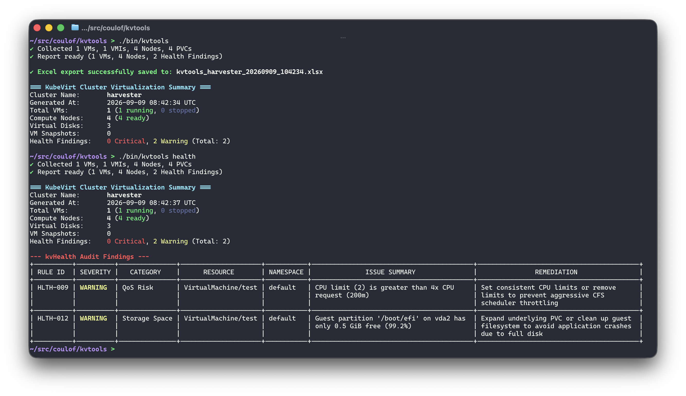
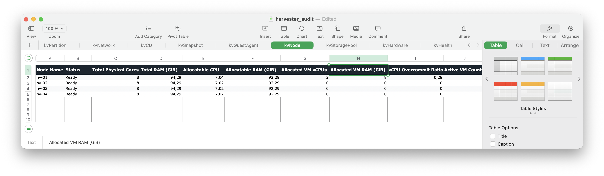

<p align="center">
  
</p>

<p align="center">
  <strong>RVTools-style inventory and health audit tool for KubeVirt clusters.</strong>
</p>

<p align="center">
  <a href="https://golang.org"></a>
  <a href="LICENSE"></a>
</p>

---

kvtools is a CLI utility that exports KubeVirt cluster inventory to Excel, JSON, CSV, or a terminal table, and runs a set of health checks against it. Works with Harvester, SUSE Virtualization, OpenShift Virtualization, and upstream KubeVirt.

<p align="center">
  
</p>

---

## Features

- 📑 **13 Excel Sheets**: `kvInfo`, `kvCPU`, `kvMemory`, `kvDisk`, `kvPartition`, `kvNetwork`, `kvCD`, `kvSnapshot`, `kvGuestAgent`, `kvNode`, `kvStoragePool`, `kvHardware`, and `kvHealth`.
- 🔍 **`kvHealth` Engine**: Built-in rules for migration blockers, storage zombies, snapshot sprawl, and sizing risks.
- ⚡ **Concurrency & Fallback**: Queries cluster objects and guest agent subresources in parallel; handles missing optional CRDs (CDI, Snapshot, Multus).
- 📦 **Zero Dependencies**: Single static binary.

---

## 13 Inventory Sheets

<p align="center">
  
</p>

| Sheet | Description |
|---|---|
| **`kvInfo`** | VM inventory, power state, node placement, guest OS, firmware/boot, TPM, uptime, and UID. |
| **`kvCPU`** | Cores, sockets, threads, vCPUs, CPU model, dedicated placement, NUMA, requests, and limits. |
| **`kvMemory`** | Guest RAM, requests, limits, launcher overhead, hugepages, and ballooning. |
| **`kvDisk`** | Disks, PVCs, DataVolumes, StorageClasses, provisioned sizes, volume modes, bus types, and CSI drivers. |
| **`kvPartition`** | Guest OS filesystem mount points, filesystem types, capacity, used space, and free %. |
| **`kvNetwork`** | Interfaces, Multus networks, binding modes (masquerade/bridge/sriov), MACs, and IPs. |
| **`kvCD`** | Attached CD-ROMs, container disks, ISOs, boot orders, and mount states. |
| **`kvSnapshot`** | VM snapshots, volume snapshots, readiness, age, and restorable capacity. |
| **`kvGuestAgent`** | QEMU guest agent connectivity, agent version, hostname, guest kernel, and timezone. |
| **`kvNode`** | Node physical cores, allocatable resources, allocated VM vCPUs/RAM, and vCPU overcommit ratio. |
| **`kvStoragePool`** | StorageClasses, provisioners, reclaim policies, binding modes, and bound PVC totals. |
| **`kvHardware`** | PCI passthrough devices, GPU/vGPU allocations, SR-IOV NICs, and host devices. |
| **`kvHealth`** | Migration blockers, storage zombies, and sizing risk findings. |

---

## Installation

### Pre-compiled Binaries (Recommended)

Download the latest release for your platform from the [GitHub Releases](https://github.com/coulof/kvtools/releases) page:

```bash
# Linux (amd64)
curl -LO https://github.com/coulof/kvtools/releases/latest/download/kvtools_v0.1.0_linux_amd64.tar.gz
tar -xzf kvtools_v0.1.0_linux_amd64.tar.gz
sudo mv kvtools /usr/local/bin/

# macOS (Apple Silicon)
curl -LO https://github.com/coulof/kvtools/releases/latest/download/kvtools_v0.1.0_darwin_arm64.tar.gz
tar -xzf kvtools_v0.1.0_darwin_arm64.tar.gz
sudo mv kvtools /usr/local/bin/
```

### From Source

```bash
git clone https://github.com/coulof/kvtools.git
cd kvtools
make build
# Binary is generated in bin/kvtools
```

---

## Usage & Examples

### 1. Export Cluster to Excel (`.xlsx`)
```bash
# Auto-names: kvtools_<cluster>_<timestamp>.xlsx
kvtools

# Or specify a custom output file
kvtools -A -o excel -f ./cluster-inventory.xlsx
```

### 2. Run Health Audit in Terminal
```bash
kvtools health
# Or
kvtools --health-only
```

### 3. Display Terminal Table for Specific Sheet
```bash
# View VM inventory
kvtools kvInfo

# View compute node allocation and overcommit
kvtools kvNode
```

### 4. Filter by Namespace
```bash
kvtools -n production -o excel -f prod-vms.xlsx
```

### 5. Export JSON / CSV
```bash
# JSON output to stdout
kvtools -A -o json > inventory.json

# Export all 13 sheets to separate CSV files
kvtools -A -o csv -f ./csv-exports/
```

### 6. Merge Multiple Excel Exports
```bash
kvtools merge cluster1.xlsx cluster2.xlsx -o merged-inventory.xlsx
```

---

## CLI Flags

| Flag | Shorthand | Default | Description |
|---|---|---|---|
| `--all-namespaces` | `-A` | `true` | Query resources across all namespaces |
| `--namespace` | `-n` | `""` | Filter resources by a specific namespace |
| `--output` | `-o` | `excel` | Output format: `excel`, `json`, `csv`, `table` |
| `--output-file` | `-f` | `""` | Output destination file or directory path |
| `--kubeconfig` | | `""` | Path to kubeconfig file |
| `--context` | | `""` | Kubernetes context to use |
| `--guest-subresources` | | `true` | Query guest agent subresources (`/guestosinfo`, `/filesystemlist`) |
| `--health-only` | | `false` | Only run and display `kvHealth` audit findings |
| `--concurrency` | `-c` | `10` | Worker pool concurrency for parallel subresource queries |
| `--quiet` | `-q` | `false` | Suppress spinner and progress output |

---

## Built-in `kvHealth` Rules

- **`HLTH-001` (CRITICAL)**: VM configured for live migration with ReadWriteOnce (RWO) PVC.
- **`HLTH-002` (WARNING)**: VM configured with `host-passthrough` CPU model.
- **`HLTH-003` (CRITICAL)**: VM mounts local `HostDisk` blocking live migration.
- **`HLTH-004` (WARNING)**: VM has direct SR-IOV NIC without bond failover.
- **`HLTH-005` (WARNING)**: Storage zombie PVC with KubeVirt metadata whose owner UID no longer exists.
- **`HLTH-006` (WARNING)**: CDI DataVolume in `Failed` or stuck `ImportInProgress` state (> 2 hours).
- **`HLTH-007` (WARNING)**: Running VM without active `qemu-guest-agent` connectivity.
- **`HLTH-008` (WARNING)**: `VirtualMachineSnapshot` age exceeding 14 days (snapshot sprawl).
- **`HLTH-009` (WARNING)**: VM CPU limits exceeding 4x CPU requests (CFS throttling risk).
- **`HLTH-010` (CRITICAL)**: VM memory limits equal to memory request with 0 overhead margin (OOM risk).
- **`HLTH-011` (WARNING)**: Node vCPU overcommit ratio exceeding 8:1.
- **`HLTH-012` (WARNING)**: Guest partition free space < 10% or < 5 GiB.
- **`HLTH-013` (INFO)**: VM has > 3 disks and > 500 GiB without dedicated IOThreads.
- **`HLTH-014` (INFO)**: VM has >= 4 cores without guest NUMA topology configured.
- **`HLTH-015` (WARNING)**: Running VM has CD-ROM / ISO device attached.
- **`HLTH-016` (WARNING)**: Host node reporting memory, disk, or PID pressure.

---

## Development & Testing

```bash
# Run unit tests
make test

# Run vet
make vet

# Build local binaries
make build
```

---

## Roadmap

- [ ] **Embedded Web UI (`kvtools serve` / `kvtools ui`)**:
  - Embedded Web UI (`//go:embed`) providing an in-browser dashboard for exploring inventory and `kvHealth` audit findings.
- [ ] **Advanced `kvHealth` Audit Rules**:
  - **Duplicate MAC Detection**: Detect duplicate MAC address assignments across running interfaces and VM specs.
  - **Windows Hyper-V Enlightenments**: Flag Windows guests missing hypervisor enlightenments (`synic`, `relaxed`, `spinlocks`, `vapic`).
  - **Oversized vCPU Allocation**: Flag VMs assigned more vCPUs than any single physical node possesses.
  - **vCPU Hotplug Ceiling Check**: Detect hotplug requests exceeding max socket topology limits.
  - **Retained Snapshot Content Auditing**: Surface orphaned `VolumeSnapshotContent` objects holding SAN/CSI storage with `deletionPolicy: Retain`.
  - **IOThreads & VirtIO-RNG Tuning**: Identify high-throughput disk workloads lacking dedicated IO threads or missing entropy devices.
- [ ] **Additional Inventory Sheets**:
  - **`kvMigration`**: Live migration history, migration durations, source/target nodes, and failure reasons.
  - **`kvEvents`**: Aggregated VM warning events over the last 24h.

---

## License

MIT License. See [LICENSE](LICENSE) for details.
